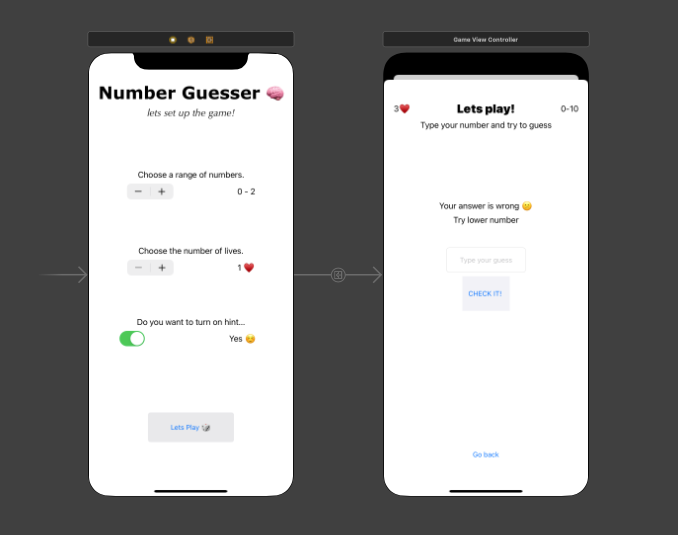
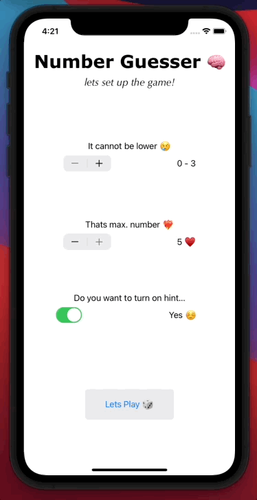

# NumberGuesser 🧠
A small application written with swift. It is a game of guessing the random number.   It has been created in such a way as to allow the user settings: 
- the number range, 
- the number of attempts to guess (lives),
- whether he wants hints to be displayed.

## Table of Contents

- [Descripition](#description)

- [Demo](#demo)

- [Techonogies](#techonogies)

- [UI description](#ui-description)

- [Settings](#settings)

- [Game Won](#game-won)

- [Game Over](#game-over)

- [Improvements](#improvements)

## Description

This project is my first project that was completely self-made using the Swift programming language with the Storyboard interface.   
This game is a self-implementation of the well-known "guess the number" idea. First, the user fills in the game settings, deciding on the range of numbers, the range of lives, and the issuing of hints. It then redirects the jets to the game screen.   The goal is to guess the number of a certain number of trials (number of lives displayed in the upper left corner). Additionally, as a reminder of the previously set range of numbers, it is displayed in the upper right corner. Guessing the number is done by writing the correct value in the text field and then clicking the "CHECK IT!" Button.   In the case of an incorrect answer, the application (with hints option) displays the information, whether to enter a bigger or smaller number.

## Demo

 

## Techonogies

It is a native application that has been made using Swift with Storyboard.

## UI description

The UI is divided into 2 parts: 
- settings screen. It allows you to choose a range of numbers, the number of trials (also known as the number of lives) and the will to introduce hints into the game.
- game screen. When the user sets the appropriate settings and then presses the "Lets Play 🎲" button, is being transferred to the game screen. It consists of a place where the number of lines is displayed (upper left corner) and a selected range of numbers (upper right corner). Below, there are feedbacks regarding the answer entered, as well as possible hints. Below of that is a textfield that allows you to enter a lucky number and also a button that allows you to check if it is a correct number. In addition, on this screen there is also a button that allows you to get back to previous menu with a selection of settings (which additionally resets the current course of the game).
 

## Settings ⚙️

 

## Game Won 🏆

 

## Game Over 💩

 

## Room for improvements

The most urgent case is the validation of the numbers entered. I have to check if they are the right type of data (a number and not a letter, for example).   
In addition, it uses force unwrap which can causes a fatal error when the button is clicked while the value of the text field is empty.

